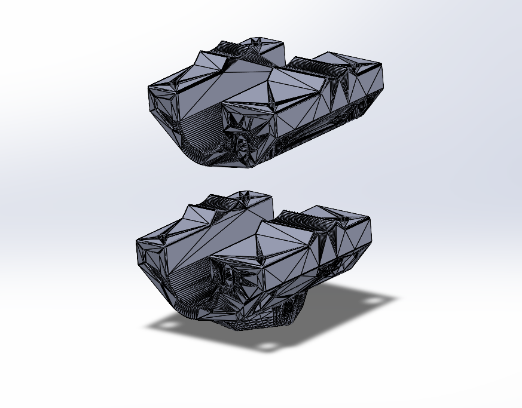
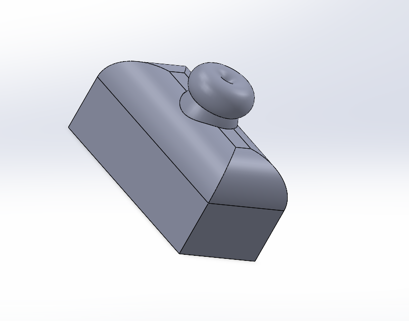

# Mechanical System 2.0

## Dev Log 9/29
* Imported several crucial C type parts into SolidWorks
* Began a assembly and played around with adding parts to it
* Watched videos to understand the workflow
* tbh need to get better at SolidWorks

## Dev Log 9/22
* Download related files from links marked as “exactly our usecase”

## Dev Log 9/15
* Began playing around with **SolidWorks**. Below is the first part I have designed with SolidWorks:

